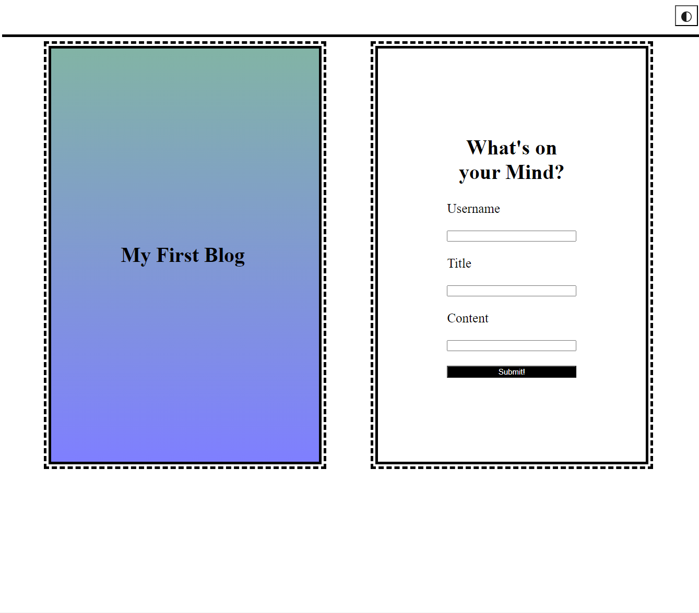

# Challenge-4-Jacqueline-Obeidzinski
This is Jaci Obeidzinski's Challenge for Module 4. The landing page will have a form containing areas for text input for a username, blog title, and blog content. When the form is submitted you will be redirected  to the post page and your last entry will be on the bottom of this page. If you wish to make another entry simply hit the back button located at the top right of the screen next to the dark mode button. 
# How it's Made:
Tech used: HTML, CSS, and JavaScript

# Lesson Learned 
During this activity Jaci learned how use JSON to save data in local storage. Jaci also learned how to make a simple dark mode toggle switch using JavaScript to add and remove a class from the body of the html. 

# Special Thanks
Thank you to everyone in my class for participating in class allowing me to learn more. 
Thank you to my instructor Chris and the Teaching Assistant Steven. 

# Screen Shot
